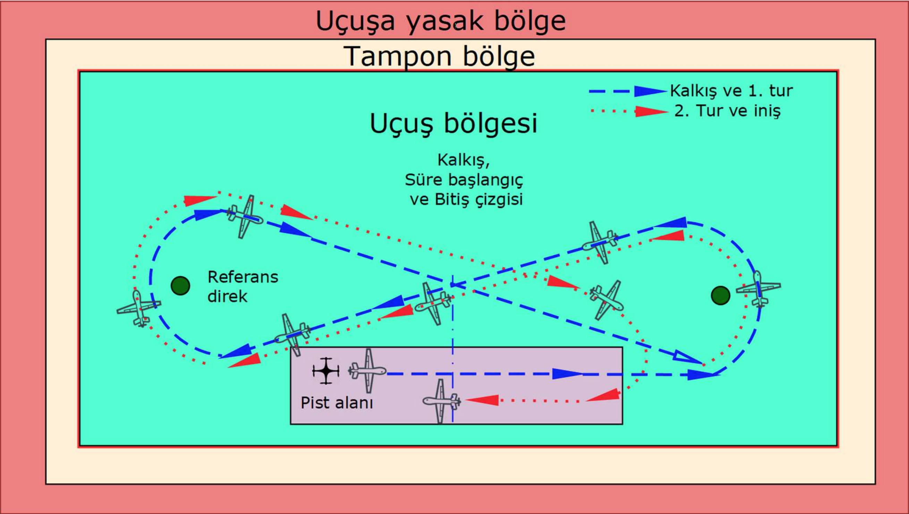

# Autonomous Quadcopter Drone

### Used Components in drone

#### - Raspberry Pi 3 Model B
#### - Pixhawk 2,1 (Cube)
#### - XBee

### 1. Task

In the first task, the manual and autonomous flight and maneuverability of the rotary wing aircraft will be tested. Furthermore, in the first task, the rotating winged UAVs will take 1 full lap during the mission flight, following a route in the form of ∞ around the reference poles indicated in below picture within the specified flight area from the specified starting point. In order to complete this flight successfully, a decent and undamaged landing is required.

### 2. Task

The second task is to transport water bottles with a volume of 330 ml that you can see in below picture. 2 bottles which have 2 different weights will be loaded autonomously and must be moved to the desired coordinates. It is also expected that the rotating vane UAVs will be able to determine the weight differences of the bottles. According to their weight, it is desired to leave different bottles in their own fields for the desired time as indicated in below picture.

### Water bottle in task 2

### Codes:
#### - Servo Controll Codes
#### - Codes for 2nd task

### Notes: 
- If you want to see videos of drone, please see videos folder.
- 1st task is done in Mission Planner
